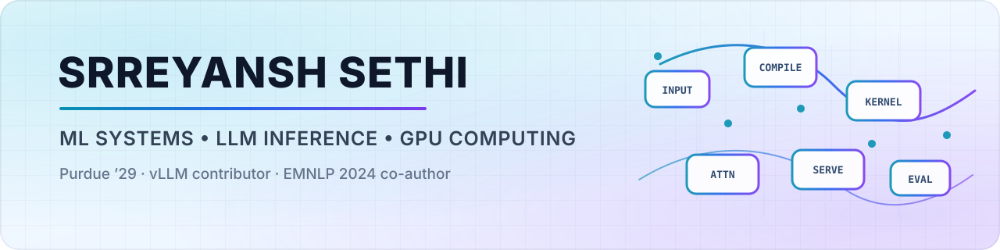

<picture>
  <source media="(prefers-color-scheme: dark)" srcset="./assets/profile-banner-dark.svg">
  <source media="(prefers-color-scheme: light)" srcset="./assets/profile-banner-light.svg">
  
</picture>

## About

I'm a Purdue University Data Science student working on **machine learning engineering and AI systems**, particularly LLM inference, GPU performance, compilation, and reliable model-serving infrastructure.

My work sits at the boundary between **performance and correctness**: reproducing systems bugs, reasoning about backend capabilities, validating GPU-specific execution paths, and turning ambiguous failures into tested upstream changes.

- 🎓 Purdue University, Data Science, Class of 2029
- ⚙️ Focused on ML systems, inference and serving, CUDA, Triton, and `torch.compile`
- 🔬 Co-author of an EMNLP 2024 Findings paper
- 💼 Seeking Summer 2027 internships in ML engineering, AI systems, and research engineering

## Selected open-source work

<table>
<tr>
<td width="50%" valign="top">

### ⚡ Marlin W4A8 expanding `ldmatrix`

**[vLLM PR #50096](https://github.com/vllm-project/vllm/pull/50096)** · `OPEN`

Implementing a CUDA 13.4 path that uses PTX expanding `ldmatrix` forms for symmetric W4A8-INT8 Marlin kernels.

- Added a standalone layout and MMA-mapping probe
- Built an SM90+ execution path with existing fallbacks preserved
- Validated the new path on H100 and the fallback path on A100

`CUDA` `PTX` `Marlin` `Quantization` `GPU Kernels`

</td>
<td width="50%" valign="top">

### 🧭 Batch-invariant backend selection

**[vLLM PR #40193](https://github.com/vllm-project/vllm/pull/40193)** · `MERGED`

Made attention-backend auto-selection aware of batch-invariance requirements so vLLM selects only compatible implementations.

- Added explicit backend capability declarations
- Covered standard attention, MLA, and Mamba selection paths
- Added regression tests and validated serving on an H100 80GB

`Attention` `Correctness` `Model Serving` `H100`

</td>
</tr>
<tr>
<td width="50%" valign="top">

### 🧩 Safer `torch.compile` cache invalidation

**[vLLM PR #26468](https://github.com/vllm-project/vllm/pull/26468)** · `MERGED` · co-developed

Co-developed opt-out configuration hashing for vLLM's `torch.compile` cache keys, ensuring newly added configuration fields participate in cache invalidation by default unless explicitly excluded.

`torch.compile` `Caching` `Configuration` `Correctness`

</td>
<td width="50%" valign="top">

### 🎥 Multimodal `/classify`

**[vLLM PR #27516](https://github.com/vllm-project/vllm/pull/27516)** · `MERGED`

Extended `/classify` to accept chat-style multimodal requests, including `video_url`, eliminating previous 400 errors and aligning classification inputs with related serving APIs.

`Multimodal` `API Design` `Serving` `Video`

</td>
</tr>
</table>

## Additional upstream contribution

### 🛠️ Clearer decode-context-parallel validation

**[vLLM PR #28443](https://github.com/vllm-project/vllm/pull/28443)** · `MERGED`

Improved DCP validation so incompatible attention backends fail with a direct explanation that decode-time softmax LSE is required, instead of surfacing a less actionable initialization error.

## Research

### 📄 Ukrainian Resilience

**[Ukrainian Resilience: A Dataset for Detection of Help-Seeking Signals Amidst the Chaos of War](https://aclanthology.org/2024.findings-emnlp.16/)**  
*Findings of EMNLP 2024*

Co-authored an **11,677-example Ukrainian-language social-media dataset** for binary classification of help-seeking signals during wartime. Contributed to dataset construction, preprocessing, model evaluation, analysis, and manuscript writing. The paper reports a GPT-3.5 baseline accuracy of **81.15%**.

## Contribution index

| Area | Contribution | Status |
|---|---|:---:|
| CUDA kernels | [#50096: Use expanding `ldmatrix` for Marlin W4A8](https://github.com/vllm-project/vllm/pull/50096) | Open |
| Attention correctness | [#40193: Make backend selection batch-invariance-aware](https://github.com/vllm-project/vllm/pull/40193) | Merged |
| DCP validation | [#28443: Make DCP error messaging clearer](https://github.com/vllm-project/vllm/pull/28443) | Merged |
| Multimodal serving | [#27516: Add chat-style multimodal support to `/classify`](https://github.com/vllm-project/vllm/pull/27516) | Merged |
| Compilation caching | [#26468: Make configuration hashing opt-out by default](https://github.com/vllm-project/vllm/pull/26468) | Merged |
| NLP research | [EMNLP 2024: Ukrainian Resilience](https://aclanthology.org/2024.findings-emnlp.16/) | Published |

## Technical focus

`LLM inference` · `model serving` · `GPU kernels` · `torch.compile` · `CUDA Graphs` · `Triton` · `quantization` · `performance validation` · `failure-oriented testing`

---

  Interested in technically substantive collaborations across ML systems, agents, computer vision, and robotics.

